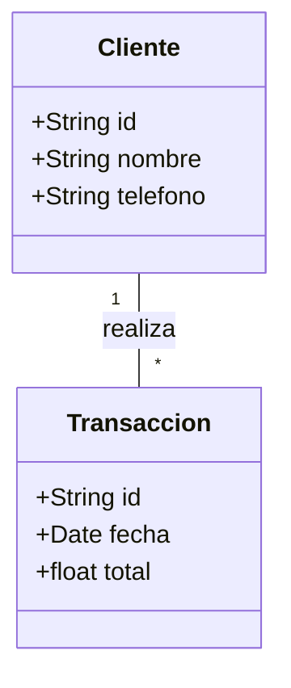
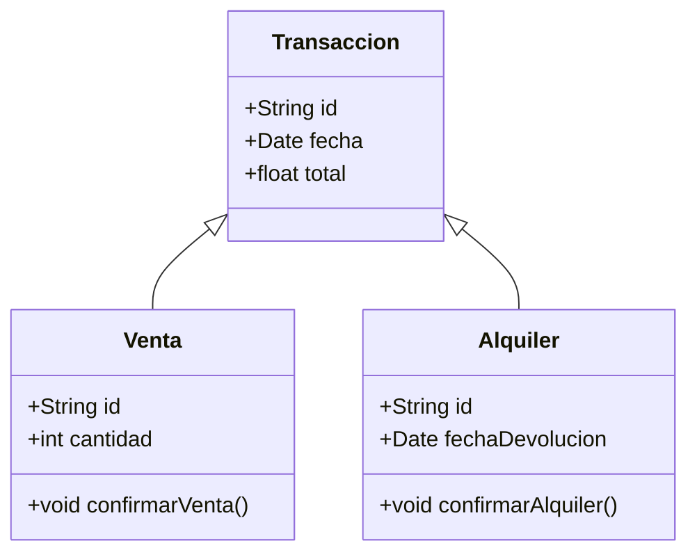
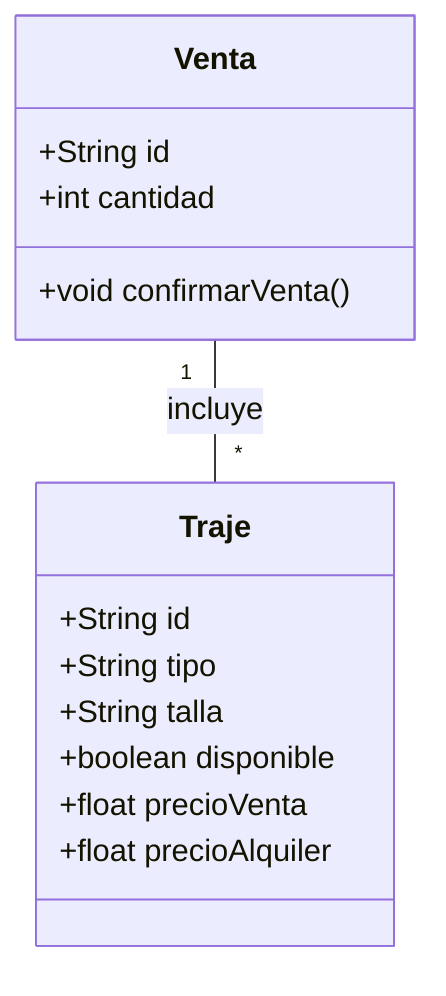
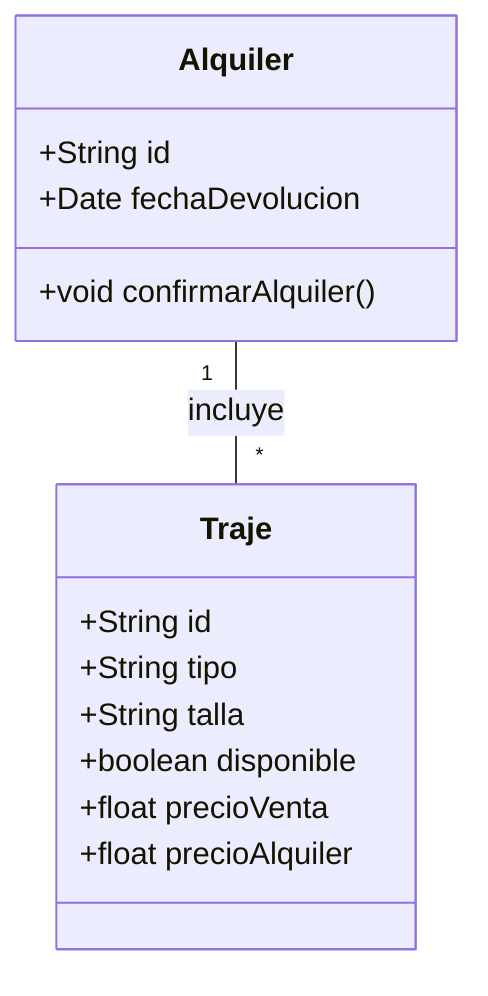
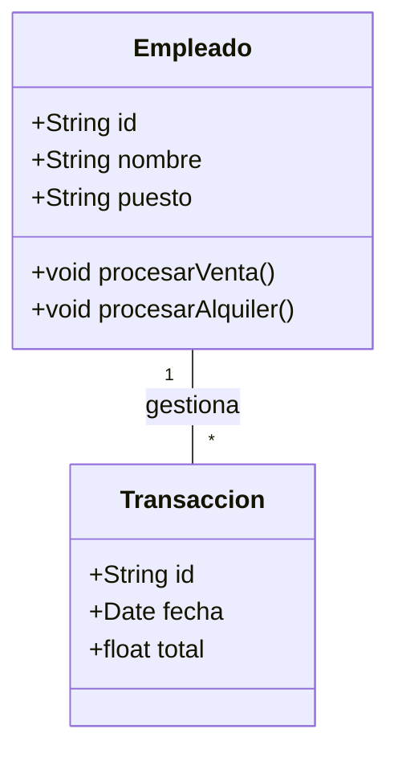
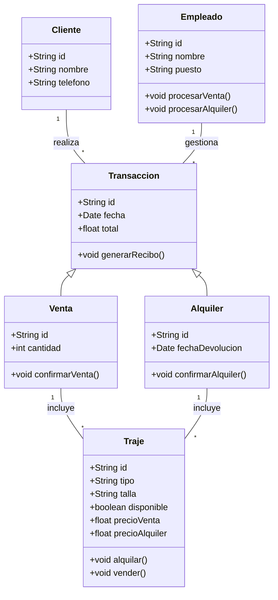

# Reto-2-POO | Objetos y clases en problemas de la vida real
A continuación se presenta la diagramación en UML de la gestión de una tienda de 
alquiler y venta de trajes formales, escogí este modelo ya que me parece apropiado
para mostrar un ejemplo de las relaciones, composiciones y herencias de clases.
## Relacion: Cliente - Transacción

Un cliente puede realizar múltiples transacciones, ya sean ventas o alquileres. Esta relación representa la interacción entre el cliente y el sistema, donde cada transacción registrada está vinculada directamente a un cliente específico, pero un cliente puede realizar tantas transacciones como sea necesario.
## Relacion: Transacción - Venta-Alquiler

La relación de herencia entre Transacción y sus subclases Venta y Alquiler muestra que ambas son tipos específicos de transacciones dentro del sistema. La clase Venta hereda las propiedades y comportamientos básicos de Transacción, pero añade características propias para manejar la venta de trajes. Muy similar a la clase Alquiler que también extiende la funcionalidad de Transacción, incluyendo atributos y métodos específicos para gestionar el alquiler de trajes. Ambas subclases comparten elementos comunes de una transacción, pero están especializadas en sus respectivas operaciones.
## Relacion: Venta - Traje

Una venta puede incluir varios trajes, es decir que en cada venta se almacena un conjunto de trajes que han sido comprados, pero los trajes en sí mismos existen independientemente de la venta, manteniendo su propio ciclo de vida en el sistema.
## Relacion: Alquiler - Traje

Similar a una venta, un alquiler puede incluir uno o más trajes. Esta relación indica que un alquiler registra qué trajes han sido rentados, pero estos siguen existiendo como entidades separadas en el sistema una vez que el alquiler ha terminado.
## Relacion: Empleado - Transacción

Los empleados están relacionados con las transacciones que gestionan, ya que son responsables de procesar tanto ventas como alquileres. Un empleado puede manejar múltiples transacciones, pero cada transacción específica está asociada a un único empleado que la supervisa.
## Diagrama de clases completo

